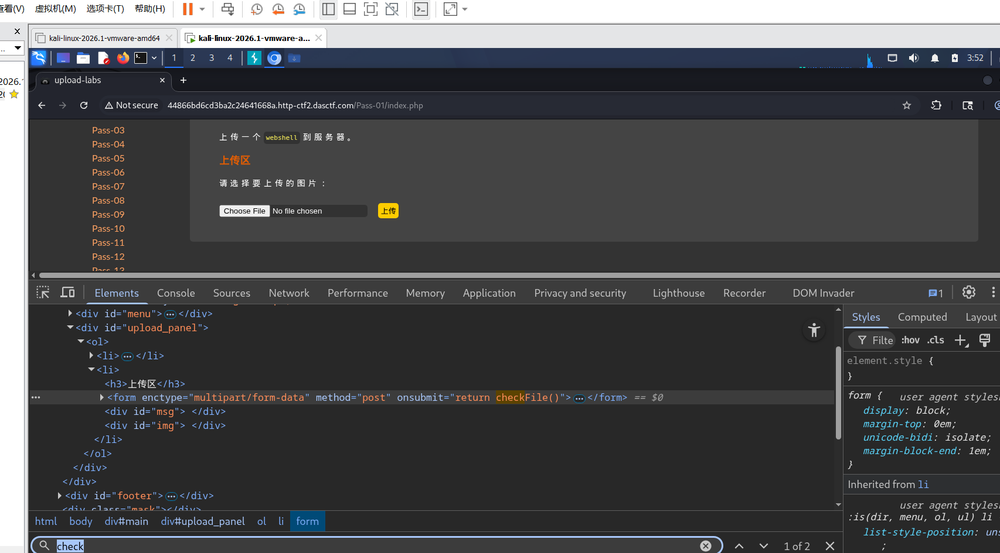
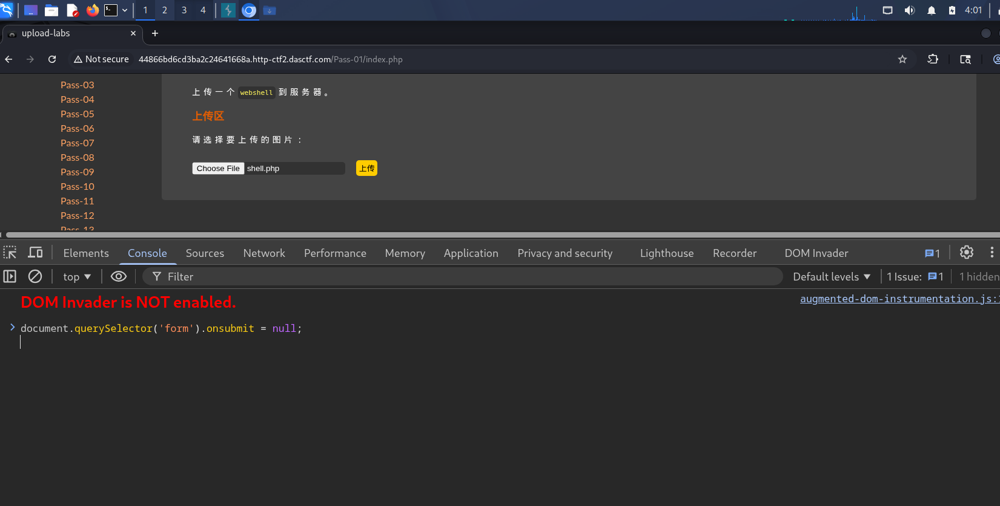
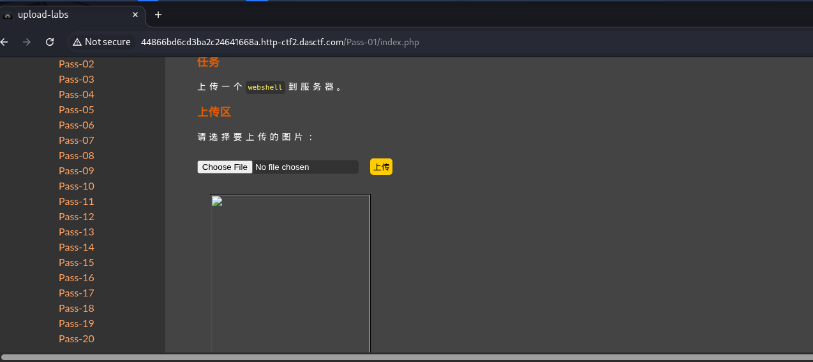
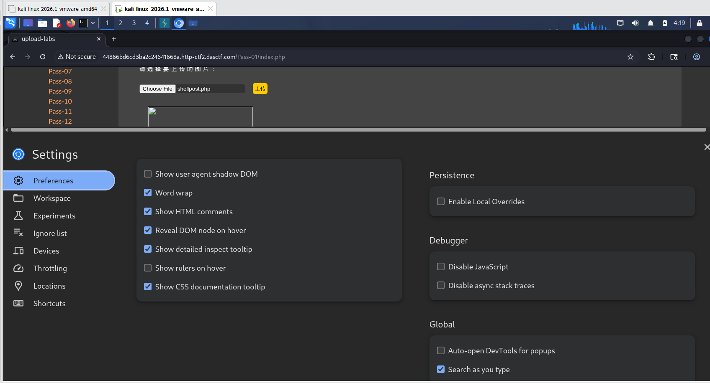
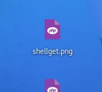
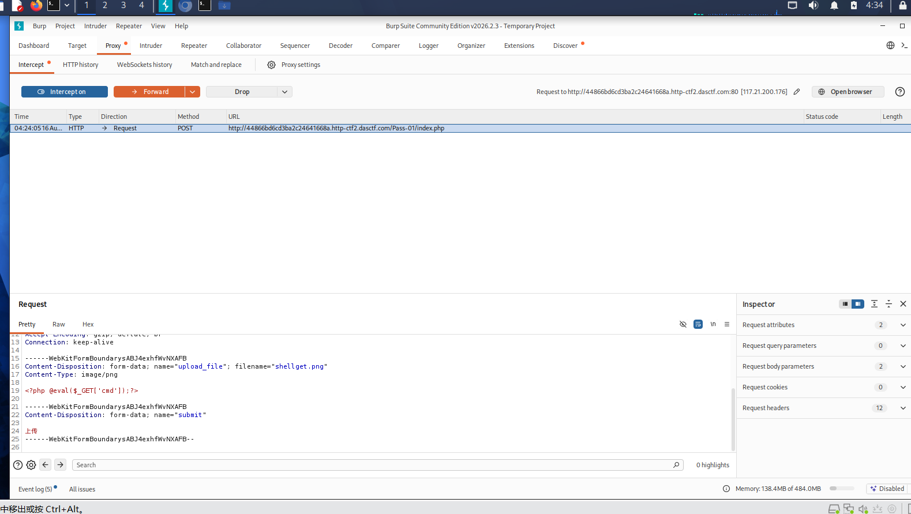

# Upload-Labs Pass-01：前端 JS 校验绕过（三种解法）

| 项目 | 内容 |
|---|---|
| 靶场 | BUUCTF · Upload-Labs-Linux |
| 难度 | Easy |
| 攻击机 | Kali 2026.1 |
| 涉及技术 | 文件上传漏洞 / 前端校验绕过 |
| 一句话总结 | 前端 JS 只做本地校验，删除 `onsubmit` 校验 / 禁用 JS / Burp 改包，均可直接上传 `.php` 一句话木马 |

**背景**：这一关的文件类型检测只由前端 JavaScript（`checkFile`）完成，请求根本没到服务端就被拦下了。目标是绕过前端检测，成功上传一句话木马。

---

## 解法一：Console 删除 onsubmit 校验（推荐）

1. 创建一个文本文件，写入一句话木马；
2. 上传该文件，发现只允许 jpg / png / gif；
3. 按 F12 打开开发者工具，在 Elements 中搜索 `checkFile`，删除 `onsubmit=...` 后再次上传 `.php` 文件；

   

4. 若仍不行，在 Console 中执行（需先输入 `allow pasting` 解除粘贴限制）：

   ```javascript
   document.querySelector('form').onsubmit = null;
   ```

   

5. 再次上传，显示上传成功。

   

### 原理：`document.querySelector('form').onsubmit = null` 拆解

**1. `document.querySelector('form')`**
`document` 代表整个 HTML 页面（DOM 文档对象），`querySelector('form')` 用 CSS 选择器找到页面里**第一个 `<form>` 表单元素**。

**2. `.onsubmit`**
每个 `<form>` 元素天生有 `onsubmit` 事件处理属性。HTML 里写：

```html
<form onsubmit="return checkFile()">
```

浏览器会自动转成：

```javascript
form.onsubmit = function() { return checkFile(); };
```

`onsubmit` 本质是**一个装着函数的普通属性**：点提交时浏览器调用 `form.onsubmit()`，`return false` 阻止提交，`return true` 才放行。

**3. `= null`**
把 `onsubmit` 赋值为 `null`，等于**把处理函数清空**。再点提交时浏览器发现没有东西要执行，表单直接发往服务端。

> 关键点：JS 属性 `onsubmit` 和 HTML 属性 `onsubmit="..."` 是绑定的——改一个，另一个同步变化。这也是在 Elements 面板直接删属性能生效的原因。

**为什么有时候要用 `cloneNode`？**
`onsubmit = null` 只能移除"属性式"绑定。如果页面用的是监听器方式绑定：

```javascript
form.addEventListener('submit', checkFile);
```

`= null` 删不掉它。而 `cloneNode(true)` 克隆的新节点**不会复制任何 `addEventListener` 监听器**，用新节点替换旧节点相当于清空所有监听器，这才是更稳的写法。

---

## 解法二：浏览器禁用 JavaScript

按 F12 打开开发者工具 → 按 F1 打开 Settings → 勾选 **Disable JavaScript**，前端校验直接失效，然后正常上传 `.php` 即可。



---

## 解法三：Burp Suite 改包绕过

1. 把木马后缀名改成 `.png` / `.jpg` / `.gif`；

   

2. 用 Burp Suite 代理浏览器，Proxy → Intercept On，上传改过名的 `.png` 文件，抓到请求包；

   

3. 找到 `filename` 这一行，把 `.png` 改回 `.php`，点 Forward，显示上传成功。

> 原理：前端 JS 被绕过后，服务端这一关没有再做校验，改包即可直接落盘 `.php`。

---

## 防御思路

- 前端校验只能作为体验优化，**不能作为安全边界**；
- 服务端必须做二次校验：扩展名白名单 + 文件头魔数检查 + 上传目录禁执行。
