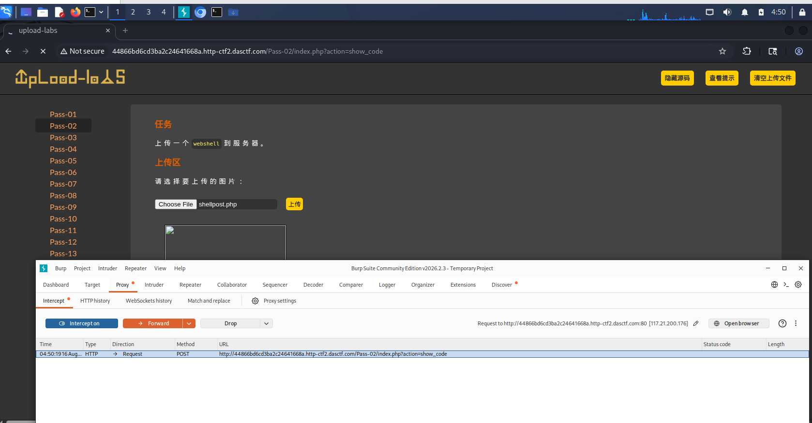
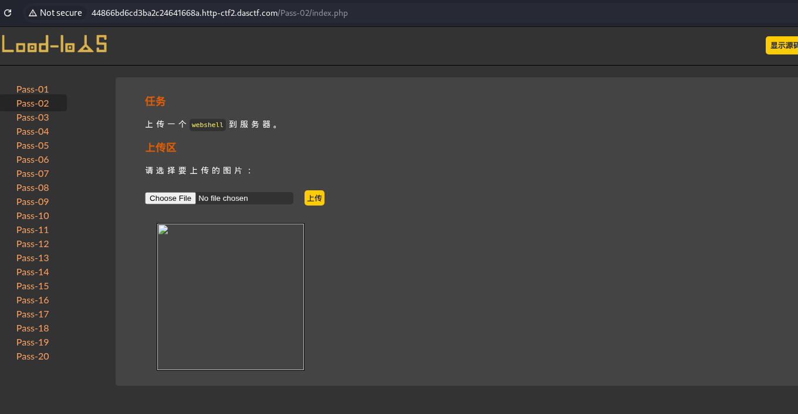
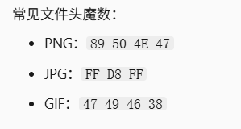

# Upload-Labs Pass-02：MIME 类型校验绕过

| 项目 | 内容 |
|---|---|
| 靶场 | BUUCTF · Upload-Labs-Linux |
| 难度 | Easy |
| 攻击机 | Kali 2026.1 |
| 涉及技术 | 文件上传漏洞 / MIME 校验绕过 / Burp Suite 改包 |
| 一句话总结 | 服务端只检查 Content-Type，用 Burp 把请求头改成 `image/jpeg` 即可上传 `.php` 木马 |

## 漏洞原理

这一关服务端不看文件扩展名，而是检查上传请求里的 `Content-Type`（即 MIME 类型）。但 MIME 是客户端自己声明的，攻击者可以随意伪造，因此校验形同虚设。

## 攻击过程

1. 打开 Burp 代理浏览器，创建一个一句话木马；
2. 打开 Proxy 上传一句话木马；

   

3. 找到 `Content-Type` 一行，修改成 `image/jpeg`（`image/png`、`image/gif` 均可）；
4. 点击 Forward，显示上传成功。

   

## 防御方法

不能信 `Content-Type`，要检查文件真实内容（文件头魔数），用文件头判断真实类型，而不是客户端报的 MIME：

