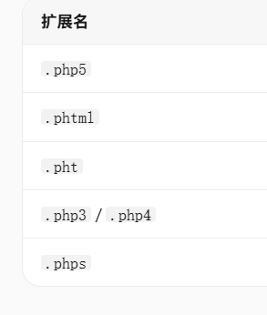

# Upload-Labs Pass-03：服务端黑名单扩展名校验绕过

| 项目 | 内容 |
|---|---|
| 靶场 | BUUCTF · Upload-Labs-Linux |
| 难度 | Easy |
| 攻击机 | Kali 2026.1 |
| 涉及技术 | 文件上传漏洞 / 黑名单绕过 |
| 一句话总结 | 黑名单只封了 .asp/.aspx/.php/.jsp，改用 .php5/.phtml 等等效扩展名即可绕过 |

## 漏洞原理

这一关是服务端黑名单扩展名校验——服务器禁止 `.asp`、`.aspx`、`.php`、`.jsp`，但**没禁止所有可执行扩展名**。黑名单天然存在遗漏。

## 攻击过程

把 `.php` 分别改为这几个后缀，部分服务器（Apache 配置了映射时）会把它们解析成 `.php`：



## 小结

本次实验比较简单，考察的是服务端黑名单校验的遗漏问题：黑名单是"封已知危险"，永远可能漏。

## 防御方法

改用**白名单**，并把上传目录设为不可执行：

```php
// 黑名单（不安全）
$deny_ext = array('.asp', '.aspx', '.php', '.jsp');

// 白名单（推荐）
$allow_ext = ['jpg', 'jpeg', 'png', 'gif'];
```
